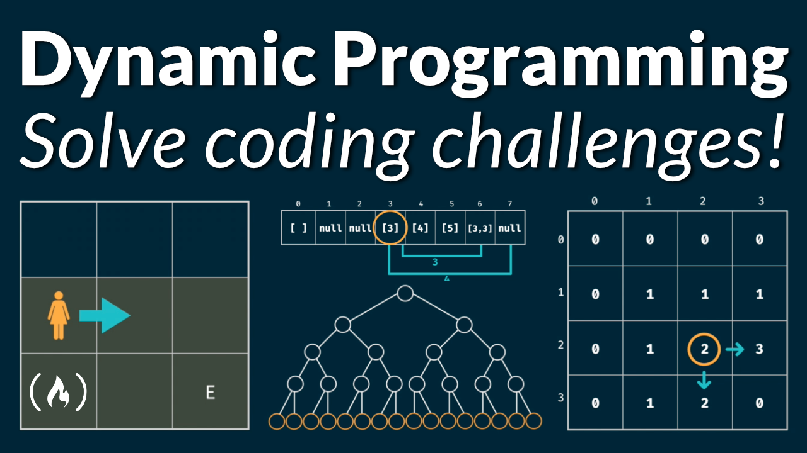

# <span style="color:#408080;"> Dynamic Programming </span>


Dynamic programming is a computer programming technique where an algorithmic problem is first broken down into sub-problems, the results are saved, and then the sub-problems are optimized to find the overall solution — which usually has to do with finding the maximum and minimum range of the algorithmic query.

## <span style="color:#408080;"> Fundamental </span>

### Memoization

<details>
<summary style="font-weight:500;">Fibonacci Problem</summary>

Write a function ``fib(n)`` that takes in a number as an argument. The function should return n-th number of the Fibonacci sequence.

The 1st and 2nd number of the sequence is 1.
To generate the next number of the sequence, we sum previous two elements.
<p style="text-align: center;">fib(n) =  1, 1, 2, 3, 5, 8, 13, 21, 34, 54, ...</p>

Recursive Algorithm

```Javascript
const fib = (n) => {
    if (n <= 2) return 1;
    return fib(n-1) + fib(n-2);
}
// Time complexity: O(2^n)
// Space Complexity: O(n)
```

Dynamic Programming

```Javascript
const fib = (n) => {
    if (n <= 2) return 1;
    let f = new Array(n);
    f[0] = 1;
    f[1] = 1;
    for (let i = 2; i < n; i++){
        f[i] = f[i-1] + f[i-2];
    }
    return f[n-1];
}
// Time complexity: O(n)
// Space Complexity: O(n)
```

</details>

<details>
<summary style="font-weight:500;">Grid Traveler</summary>

Say that you are a traveler on a 2D grid. You begin in the top-left corner and your goal is to travel to the bottom-right corner. You may only move down or right.

Example:
<div style="display:flex; gap:2%;flex-wrap:wrap;">
<table>
<tr>
<th> Explain </th>
<th> gridTraveler(1,1) = 1 </th>
</tr>
<tr>
<td>

1. "do nothing"

</td>
<td>

| S/E |
|-----|

</td>
</tr>
</table>

<table>
<tr>
<th> Explain </th>
<th> gridTraveler(0,1) = 0 </th>
</tr>
<tr>
<td>

1. "invalid"

</td>
<td>

</td>
</tr>
</table>

<table>
<tr>
<th> Explain </th>
<th> gridTraveler(2,3) = 3 </th>
</tr>
<tr>
<td>

1. right - down - right

    ```text
    (2,2) -> (1,2) -> (1,1)
    ```

2. right - right - down

    ```text
    (2,2) -> (2,1) -> (1,1)
    ```

3. down - right - right

    ```text
    (1,3) -> (1,2) -> (1,1)
    ```

</td>
<td>

|  S  |     |     |
|-----|-----|-----|
|     |     |  E  |

</td>
</tr>
</table>
</div>

```Javascript
const gridTraveler = (m,n,memo={}) => {
    let key = m + ',' + n;
    if(key in memo) return memo[key]; // break branch if value of (m,n) is calculated in other branch
    if (m == 0 || n == 0) return 0; // check valid
    if (m == 1 && n == 1) return 1; // go to target
    memo[key] = gridTraveler(m-1, n,memo) + gridTraveler(m, n-1,memo);
    return memo[key] // move down or right
}
console.log(gridTraveler(7,8)) // Output = 1716
// memoized : O(m*n) time, O(m+n) space
```

</details>

<details>
<summary style="font-weight:500;">Memoization Recipe</summary>

1. Make it work
    - visualize the problem as a tree
    - implement the tree using recursion
    - test it
2. Make it efficient
    - add a memo object
    - add a base case to return memo value
    - store return value into memo

</details>

<details>
<summary style="font-weight:500;">canSum Memoization </summary>

Write a function ```canSum(targetSum, numbers)``` that takes in a targetSum and an array of numbers as argument.

The function should return a boolean indicating whether or not it is possible to generate the targetSum using numbers (two elements in every pair is different) from the array.

Constraint: all input numbers are nonnegative.

```Javascript
const canSum = (targetSum, numbers, begin, memo={}) => {
    if (targetSum in memo) return memo[targetSum];
    if (targetSum === 0) return true;
    if (targetSum < 0) return false;
    for (let index = begin; index < numbers.length; index++){
        if (canSum(targetSum - numbers[index], numbers,index+1,memo) === true){
            memo[targetSum] = true;
            return true;
        }
    }
    memo[targetSum] = false;
    return false;
}
console.log(canSum(6, [2,5,3,4], 0)); // true
// m : value of target sum, n: length of array
// Complexity: O(m*n) time, O(m) space
```

</details>

## <span style="color:#408080;"> Problem Set </span>

| Problem | Difficulty | Tips | Solutions | Complexity |
|---------|------------|---------|------------|--------------|
| [198. House Robber](https://leetcode.com/problems/house-robber/) | Medium |  | [Javascript](../../solution/198_House_Robber.js) </br> [Python](../../solution/198_House_Robber.py) | ? |
