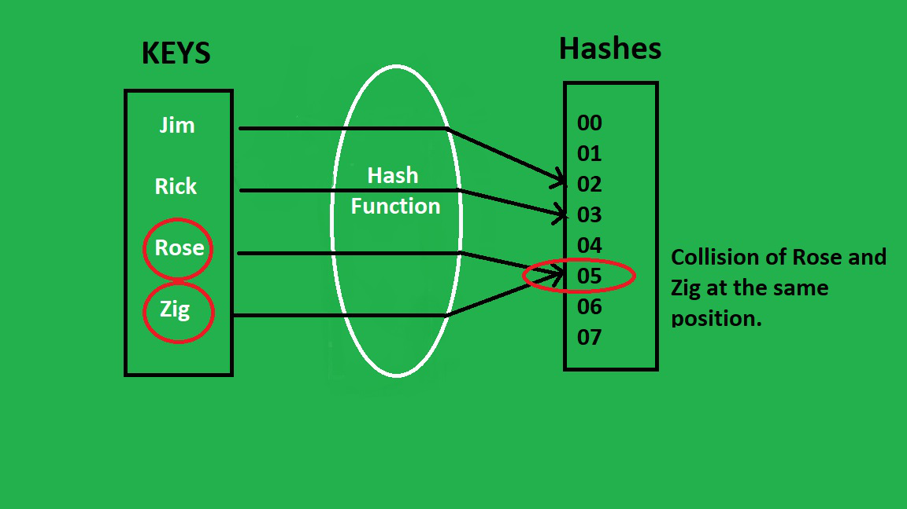

# Hashing

## Problem Set

| Problem | Difficulty | Tips | Solutions | Complexity |
|---------|------------|---------|------------|--------------|
| [187. Repeated DNA Sequences](https://leetcode.com/problems/contains-duplicate/) | Medium | using dictionary in Python, unordered_map in C++   Sliding Window|[Python](../../../solution/187_Repeated_DNA_Sequences.py) | Time: O(n)   Space: O(n) |
