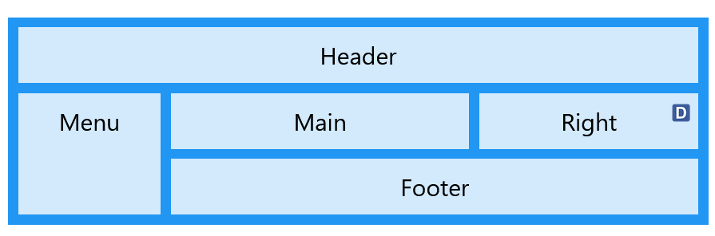
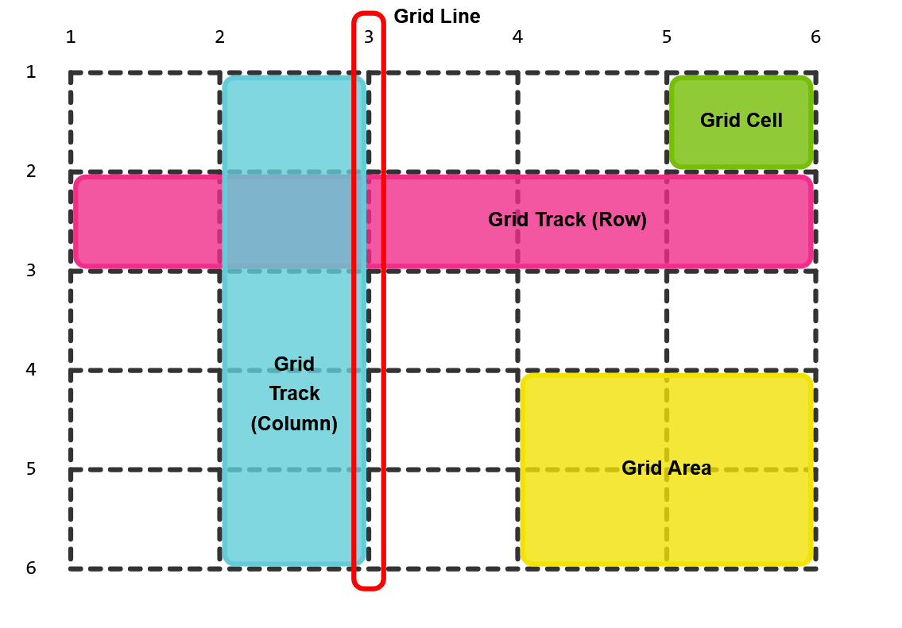

# CSS grid layout

The CSS Grid Layout Module offers a grid-based layout system, with rows and columns, making it easier to design web pages without having to use floats and positioning.

- CSS grid game: [Grid garden](https://cssgridgarden.com/), [CSS grid attack](https://codingfantasy.com/games/css-grid-attack/play)

- Code mẫu: [html file](./code/grid/index.html), [css file](./code/grid/style.css)
