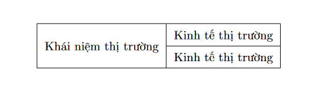

# Table Collection

## Table Example

```latex
\begin{center}
    \begin{tabular}{|c|c|c|}
    \hline
    \multicolumn{2}{|c|}{\multirow{2}{*}{Khái niệm thị trường}} & Cơ chế thị trường \\
    \cline{3-3}
    \multicolumn{2}{|c|}{} & Kinh tế thị trường \\
    \hline
    \end{tabular}
\end{center}
```



[https://texblog.org/2012/12/21/multi-column-and-multi-row-cells-in-latex-tables/](https://texblog.org/2012/12/21/multi-column-and-multi-row-cells-in-latex-tables/)