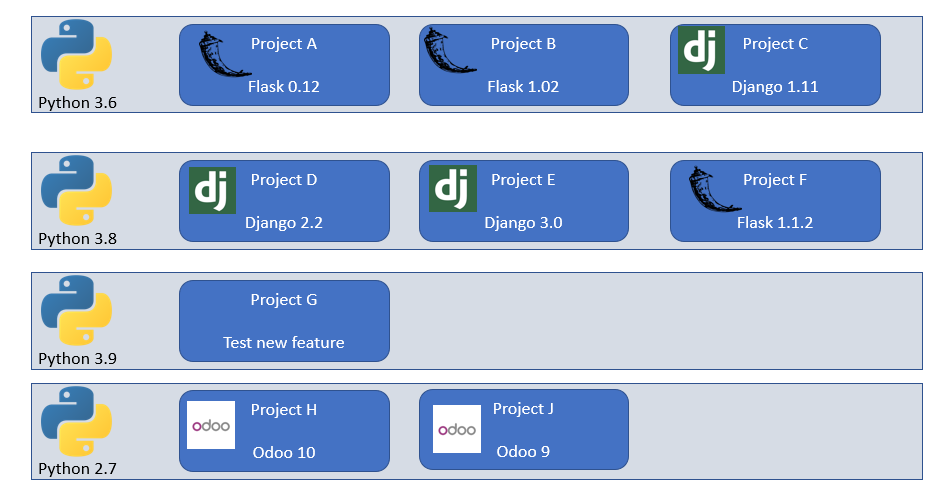
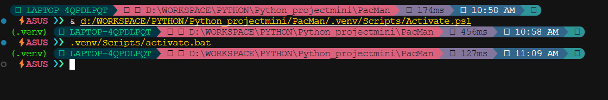
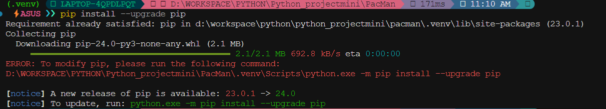

# Python Virtual Environment - Môi trường lập trình ảo

## I. Giới thiệu

Thiết lập môi trường ảo giúp bạn thoải mái thực hiện cài đặt rồi xóa, cài đặt các phiên bản khác nhau lung tung với các packages của Python mà không sợ ảnh hưởng đến những dự án có sẵn.

### Lợi ích

- Đối với mỗi phiên bản của các framework sẽ không xảy ra xung đột vì đã có môi trường ảo cài riêng cho từng phần.



- Ngoài lợi ích trên, VE còn cung cấp chức năng cho phép export chính xác các package đang sử dụng trong VE (chính xác đến tận version bao nhiêu), file cấu hình môi trường này thường được đặt tên là requirements.txt. 

## II. Cách xây dựng và sử dụng VE

- Khởi tạo thư mục cho venv

```bash
python3 -m venv folder_name
```

- Kích hoạt virtual environment

```bash
folder_name\Scripts\active.bat
```



- Cập nhật modules

```bash
pip install --upgrade pip
```



- ```pip freeze```: kiểm tra xem trong virtual environmnet đã có bao nhiêu packages được cài đặt

- Set up packages for workspace:```pip -r requirements.txt```
(requirements dùng để chứa các lib cần thiết)
- Để tìm hiểu các packages:```pip show lib_name```

- Để thoát virtual environment: ```deactivate```
